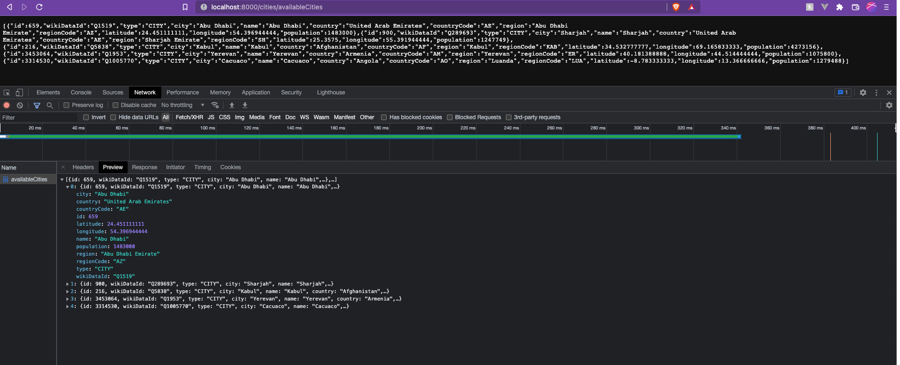
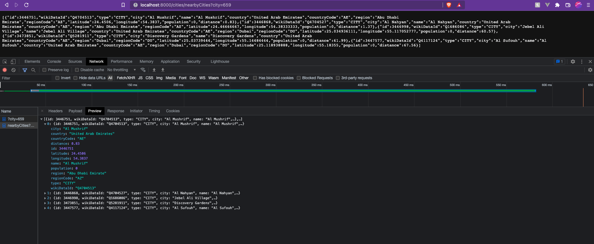
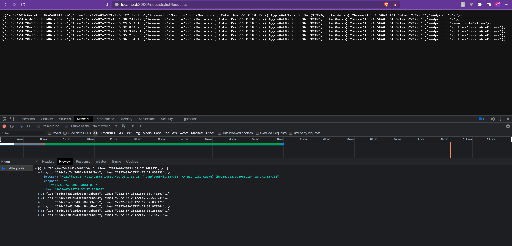

# City API

## Note regarding environment files:
*Naturally in a realistic setting I wouldn't just expose API keys and secrets in a repository. I've done so here to allow whoever is reading this repository to see how and what is being loaded in the `load_config` function in `settings.py`*

## Features:
- FastAPI - I thought this might be a nice opportunity to learn and use it!
- MongoDB - For storage of request information

### How to run the application:
0. Make sure you have `Docker` and `MongoDB` installed and running on your system
1. Clone the repo onto your machine
2. Make your way into the root directory of the project
3. Run `docker compose up` to get the application up and running
4. Go to `0.0.0.0:8000` and you should be met with:
    - `{"message": alive"}`
5. If you then try to access `http://0.0.0.0:8000/docs` you'll see that we have two specific endpoints where:
    - `/cities` - endpoint contains all city-related functions
    - and `/requests` - endpoint contains all requests-related functions

## Example Usage
#### `/cities/availableCities`

- Assumes a minimum population of 1000000
```
[
  {
    "id":659,
    "wikiDataId":"Q1519",
    "type":"CITY",
    "city":"Abu Dhabi",
    "name":"Abu Dhabi",
    "country":"United Arab Emirates",
    "countryCode":"AE",
    "region":"Abu Dhabi Emirate",
    "regionCode":"AZ",
    "latitude":24.451111111,
    "longitude":54.396944444,
    "population":1483000
  },
  {
    "id":900,
    "wikiDataId":"Q289693",
    "type":"CITY",
    "city":"Sharjah",
    "name":"Sharjah",
    "country":"United Arab Emirates",
    "countryCode":"AE",
    "region":"Sharjah Emirate",
    "regionCode":"SH",
    "latitude":25.3575,
    "longitude":55.391944444,
    "population":1247749
  },
  {
    "id":216,
    "wikiDataId":"Q5838",
    "type":"CITY",
    "city":"Kabul",
    "name":"Kabul",
    "country":"Afghanistan",
    "countryCode":"AF",
    "region":"Kabul",
    "regionCode":"KAB",
    "latitude":34.532777777,
    "longitude":69.165833333,
    "population":4273156
  },
  {
    "id":3453064,
    "wikiDataId":"Q1953",
    "type":"CITY",
    "city":"Yerevan",
    "name":"Yerevan",
    "country":"Armenia",
    "countryCode":"AM",
    "region":"Yerevan",
    "regionCode":"ER",
    "latitude":40.181388888,
    "longitude":44.514444444,
    "population":1075800
  },
  {
    "id":3314530,
    "wikiDataId":"Q1005770",
    "type":"CITY",
    "city":"Cacuaco",
    "name":"Cacuaco",
    "country":"Angola",
    "countryCode":"AO",
    "region":"Luanda",
    "regionCode":"LUA",
    "latitude":-8.783333333,
    "longitude":13.366666666,
    "population":1279488
  }
]
```

#### `cities/nearbyCities/?city=659`

- Assumes a radius of 100 (default value in the API)
```
[
  {
    "id":3446751,
    "wikiDataId":"Q4704513",
    "type":"CITY",
    "city":"Al Mushrif",
    '"name":"Al Mushrif",
    "country":"United Arab Emirates",
    "countryCode":"AE",
    "region":"Abu Dhabi Emirate",
    "regionCode":"AZ",
    "latitude":24.4506,
    "longitude":54.3837,
    "population":0,
    "distance":0.83
  },
  {
    "id":3446868,
    "wikiDataId":"Q4704527",
    "type":"CITY",
    "city":"Al Nahyan",
    "name":"Al Nahyan",
    "country":"United Arab Emirates",
    "countryCode":"AE",
    "region":"Abu Dhabi Emirate",
    "regionCode":"AZ",
    "latitude":24.46666667,
    "longitude":54.38333333,
    "population":0,
    "distance":1.37
  },
  {
    "id":3446998,
    "wikiDataId":"Q1686086",
    "type":"CITY",
    "city":"Jebel Ali Village",
    "name":"Jebel Ali Village",
    "country":"United Arab Emirates",
    "countryCode":"AE",
    "region":"Dubai",
    "regionCode":"DU",
    "latitude":25.034936111,
    "longitude":55.117052777,
    "population":0,"distance":60.57
  },
  {
    "id":3473851,
    "wikiDataId":"Q5281911",
    "type":"CITY",
    "city":"Discovery Gardens",
    "name":"Discovery Gardens",
    "country":"United Arab Emirates",
    "countryCode":"AE",
    "region":"Dubai",
    "regionCode":"DU",
    "latitude":25.03739444,
    "longitude":55.14484444,
    "population":0,
    "distance":61.99
  },
  {
    "id":3447577,
    "wikiDataId":"Q4117124",
    "type":"CITY",
    "city":"Al Sufouh",
    "name":"Al Sufouh",
    "country":"United Arab Emirates",
    "countryCode":"AE",
    "region":"Dubai",
    "regionCode":"DU",
    "latitude":25.118938888,
    "longitude":55.18355,
    "population":0,
    "distance":67.56
  }
]
```

#### `requests/listRequests/`

```
[
  {
    "id":"62dc6ec74c3d82a5d814f0ab",
    "time":"2022-07-23T21:57:27.868933",
    "browser":"Mozilla/5.0 (Macintosh; Intel Mac OS X 10_15_7) AppleWebKit/537.36 (KHTML, like Gecko) Chrome/103.0.5060.134 Safari/537.36",
    "endpoint":"/"
  },
  {
    "id":"62dc6f4a3b5d9cb86fc8be69",
    "time":"2022-07-23T21:59:38.741297",
    "browser":"Mozilla/5.0 (Macintosh; Intel Mac OS X 10_15_7) AppleWebKit/537.36 (KHTML, like Gecko) Chrome/103.0.5060.134 Safari/537.36",
    "endpoint":"/"
  },
  {
    "id":"62dc70a93b5d9cb86fc8be6a",
    "time":"2022-07-23T22:05:29.563649",
    "browser":"Mozilla/5.0 (Macintosh; Intel Mac OS X 10_15_7) AppleWebKit/537.36 (KHTML, like Gecko) Chrome/103.0.5060.134 Safari/537.36",
    "endpoint":"/availableCities"
  },
  {
    "id":"62dc70ac3b5d9cb86fc8be6b",
    "time":"2022-07-23T22:05:32.883375",
    "browser":"Mozilla/5.0 (Macintosh; Intel Mac OS X 10_15_7) AppleWebKit/537.36 (KHTML, like Gecko) Chrome/103.0.5060.134 Safari/537.36",
    "endpoint":"/cities/availableCities"
  },
  {
    "id":"62dc70ad3b5d9cb86fc8be6c",
    "time":"2022-07-23T22:05:33.978764",
    "browser":"Mozilla/5.0 (Macintosh; Intel Mac OS X 10_15_7) AppleWebKit/537.36 (KHTML, like Gecko) Chrome/103.0.5060.134 Safari/537.36",
    "endpoint":"/cities/availableCities"
  },
  {
    "id":"62dc70af3b5d9cb86fc8be6d",
    "time":"2022-07-23T22:05:35.255850",
    "browser":"Mozilla/5.0 (Macintosh; Intel Mac OS X 10_15_7) AppleWebKit/537.36 (KHTML, like Gecko) Chrome/103.0.5060.134 Safari/537.36",
    "endpoint":"/cities/availableCities"
  },
  {
    "id":"62dc70b03b5d9cb86fc8be6e",
    "time":"2022-07-23T22:05:36.154513",
    "browser":"Mozilla/5.0 (Macintosh; Intel Mac OS X 10_15_7) AppleWebKit/537.36 (KHTML, like Gecko) Chrome/103.0.5060.134 Safari/537.36",
    "endpoint":"/cities/availableCities"
  }
]
```